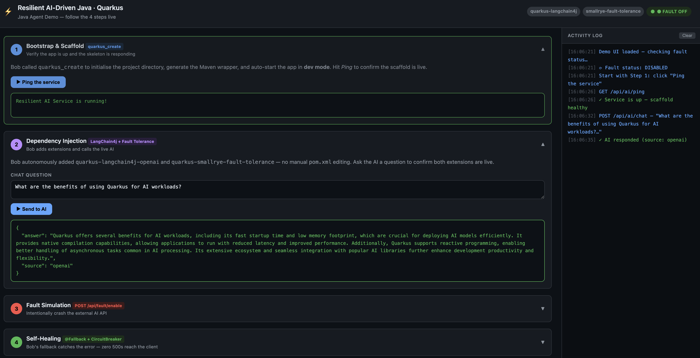

# Resilient AI-Driven Java with Quarkus

A **Java Agent Demo** showcasing how Bob (the Quarkus AI agent) builds a
production-grade resilient, AI-powered Java microservice — **live, in front of an audience,
in four repeatable steps**.

---

## Scaffold-Only Prompt (quickstart)

If you just want Bob to create the project skeleton and start it in dev mode,
paste this minimal prompt — no details required:

```
Use quarkus_create to scaffold a new "resilient-ai-driven-java-quarkus" project.
```

> **Will Bob infer features from the name?**
> Short answer: **no — not automatically.** Bob follows a strict *Extension-First* rule:
> it always searches for matching extensions and presents options to you before writing
> any code.  A descriptive name like `resilient-ai-driven-java-quarkus` will *not* silently
> trigger fault-tolerance or AI extensions.  Bob will scaffold a bare skeleton and then
> ask which extensions you want.
>
> To get all four steps in one shot, use the full prompt below.

---

## Replaying the Demo with Bob (empty directory)

Open Bob in an **empty directory** and paste this single prompt.
Bob will execute all four steps autonomously — no manual commands needed.

```
1. Use quarkus_create to scaffold "resilient-ai-driven-java-quarkus" (groupId org.acme) with quarkus-rest-jackson, quarkus-smallrye-health, and quarkus-hibernate-validator, then expose GET /api/ai/ping.

2. Add quarkus-langchain4j-openai (with quarkus-langchain4j-bom) and quarkus-smallrye-fault-tolerance; create a @RegisterAiService AiAssistant with String chat(String question) backed by gpt-4o-mini via OPENAI_API_KEY, expose POST /api/ai/chat returning {answer, source:"openai"}, and wrap every call in ResilientAiService with @Timeout(30s) @Retry(maxRetries=2) @CircuitBreaker @Fallback(chatFallback) where chatFallback(String question) returns {answer, source:"fallback"} and logs WARN [SELF-HEAL].

3. Add @ApplicationScoped FaultSimulator (AtomicBoolean) whose throwIfSimulating() throws RuntimeException; call it first in ResilientAiService.chat() and expose POST /api/fault/enable, DELETE /api/fault/disable, GET /api/fault/status to toggle it.

4. Serve a dark-themed SPA at http://localhost:8080 (META-INF/resources/index.html) with four collapsible step cards (Ping, AI chat, fault Enable/Disable/Status + fault-active chat, recovery chat + health check), a live FAULT ON/OFF header pill, colour-coded response boxes (green/orange/red), and a right-side timestamped Activity Log; write @QuarkusTest tests using @InjectMock AiAssistant and @Inject FaultSimulator, and keep README.md updated.
```

> **Tip:** export your OpenAI key first so the app starts cleanly:
> ```bash
> export OPENAI_API_KEY=sk-...
> ```

---

## The 4-Step Bob Demo

### Step 1 — Bootstrap & Scaffold

Bob is prompted to scaffold the project from scratch using `quarkus_create`:

```
User → Bob: "Create a Quarkus app called resilient-ai-driven-java-quarkus
             with REST, Jackson, health checks, and bean validation."
```

Bob calls `quarkus_create` internally, which generates the Maven project, wrapper
scripts, and starter structure.  The project directory is initialized and the app
auto-starts in **dev mode** (hot reload enabled):

```bash
# What Bob does behind the scenes:
./mvnw quarkus:dev
```

**Outcome:** A running Quarkus skeleton at `http://localhost:8080` with
`GET /api/ai/ping` already responding.

---

### Step 2 — Dependency Injection

Bob autonomously discovers and adds two extensions without any manual `pom.xml` editing:

| Extension | Purpose |
|---|---|
| `quarkus-langchain4j-openai` | Connects to OpenAI (GPT-4o-mini) via `@RegisterAiService` |
| `quarkus-smallrye-fault-tolerance` | Provides `@Retry`, `@CircuitBreaker`, `@Timeout`, `@Fallback` |

Bob calls `quarkus_searchTools` to find extension-management tools, then
`quarkus_callTool` with `devui-extensions_addExtension` to install each one — **no
`mvn` command typed by a human**.

Bob also loads `quarkus_skills` for both extensions before writing any code, ensuring
correct patterns are applied from the start.

**Outcome:** `pom.xml` gains the two dependencies; the app hot-reloads with AI and
fault-tolerance capabilities ready.

---

### Step 3 — Fault Simulation

To show the audience a *real crash*, a fault-simulation toggle is built in:

```bash
# Enable the simulated external API outage
curl -s -X POST http://localhost:8080/api/fault/enable | jq .
```

```json
{
  "faultSimulation": "ENABLED",
  "effect": "AI calls will now throw RuntimeException to simulate an API outage",
  "step": "3 — Fault Simulation active. Call POST /api/ai/chat to observe failures.",
  "selfHeal": "SmallRye Fault Tolerance will retry, open circuit, and invoke fallback automatically"
}
```

Now fire a chat request — watch the application **not** crash:

```bash
curl -s -X POST http://localhost:8080/api/ai/chat \
  -H "Content-Type: application/json" \
  -d '{"question": "What is Quarkus?"}' | jq .
```

The Quarkus dev-mode console shows the fault-tolerance machinery working in real time:

```
WARN  [SELF-HEAL] chatFallback invoked for question='What is Quarkus?'.
       Fault simulation active: true
```

Check current fault state at any time:

```bash
curl -s http://localhost:8080/api/fault/status | jq .
```

---

### Step 4 — Self-Healing

Bob captured the `RuntimeException` that `throwIfSimulating()` raises and wired in
a `@Fallback` method.  The full resilience chain fires automatically:

```
Request → @Timeout(30s)
        → @Retry(maxRetries=2, delay=1s)   ← retries the failing call twice
        → @CircuitBreaker(failureRatio=0.6) ← opens after 3/5 failures
        → @Fallback(chatFallback)           ← graceful degraded response
```

The caller always receives **HTTP 200** — never a 500:

```json
{
  "answer": "I'm currently unable to process your request due to: simulated API outage ...",
  "source": "fallback"
}
```

Restore normal operation — the circuit breaker will close after 2 healthy responses:

```bash
curl -s -X DELETE http://localhost:8080/api/fault/disable | jq .
```

```bash
# Confirm recovery
curl -s -X POST http://localhost:8080/api/ai/chat \
  -H "Content-Type: application/json" \
  -d '{"question": "What is fault tolerance?"}' | jq .
# → "source": "openai"
```

---

## All Endpoints

| Method | Path | Description |
|---|---|---|
| `GET` | `/api/ai/ping` | Health ping (plain text) |
| `POST` | `/api/ai/chat` | Ask the AI a question |
| `POST` | `/api/fault/enable` | **Step 3** — Enable fault simulation |
| `DELETE` | `/api/fault/disable` | Restore normal operation |
| `GET` | `/api/fault/status` | Query fault-simulation state |
| `GET` | `/q/health/live` | Liveness health check |
| `GET` | `/q/health/ready` | Readiness health check (includes AI service check) |
| `GET` | `/q/health` | Combined health check |

---

## Features

| Feature | Extension |
|---|---|
| AI Chat endpoint (GPT-4o-mini) | `quarkus-langchain4j-openai` |
| Circuit Breaker | `quarkus-smallrye-fault-tolerance` |
| Retry with backoff | `quarkus-smallrye-fault-tolerance` |
| Timeout | `quarkus-smallrye-fault-tolerance` |
| Fallback responses | `quarkus-smallrye-fault-tolerance` |
| Fault Simulation toggle | `FaultSimulator` + `FaultSimulationResource` |
| Health checks (liveness + readiness) | `quarkus-smallrye-health` |
| Bean validation on requests | `quarkus-hibernate-validator` |
| JSON serialization | `quarkus-rest-jackson` |

---

## Resilience Patterns in Detail

### Chat endpoint (`/api/ai/chat`)
- **Timeout**: 30 seconds
- **Retry**: up to 2 retries, 1 s delay, on `RuntimeException`
- **Circuit Breaker**: opens after 60 % failure rate over 5 requests, stays open for 15 s
- **Fallback**: `chatFallback()` — returns graceful degraded response

---

## Getting Started

### Prerequisites
- Java 17+
- Maven 3.9+
- An [OpenAI API key](https://platform.openai.com/api-keys)

### Run in dev mode

```bash
export OPENAI_API_KEY=sk-...
./mvnw quarkus:dev
```

### Demo UI



Open **[http://localhost:8080](http://localhost:8080)** in your browser.

The single-page UI walks through all 4 steps interactively — no `curl` required:

| Panel | What it does |
|---|---|
| **Step 1 – Bootstrap** | Ping button verifies the scaffold is live |
| **Step 2 – Dependency Injection** | Live AI chat with real OpenAI responses |
| **Step 3 – Fault Simulation** | Toggle the crash flag, fire failing requests, watch fallback fire |
| **Step 4 – Self-Healing** | Disable the flag, confirm circuit closes, health check |

A real-time **Activity Log** panel on the right records every API call with colour-coded
outcomes (`green` = openai, `orange` = fallback, `red` = error).

### Run the full 4-step demo (curl alternative)

```bash
# Step 1 — verify scaffold is up
curl http://localhost:8080/api/ai/ping

# Step 2 — AI + fault tolerance extensions loaded (check pom.xml)

# Step 3 — break it
curl -s -X POST http://localhost:8080/api/fault/enable | jq .

# Step 3 continued — observe graceful fallback (not a 500)
curl -s -X POST http://localhost:8080/api/ai/chat \
  -H "Content-Type: application/json" \
  -d '{"question": "What is Quarkus?"}' | jq .

# Step 4 — watch the WARN log in dev console, then restore
curl -s -X DELETE http://localhost:8080/api/fault/disable | jq .

# Confirm recovery
curl -s -X POST http://localhost:8080/api/ai/chat \
  -H "Content-Type: application/json" \
  -d '{"question": "What is Quarkus?"}' | jq .
```

### Other example requests

**Health check:**
```bash
curl -s http://localhost:8080/q/health | jq .
```

---

## Project Structure

```
src/main/java/org/acme/
├── ai/
│   └── AiAssistant.java              # LangChain4j AI service interface (@RegisterAiService)
├── dto/
│   ├── ChatRequest.java              # Validated chat request DTO
│   └── ChatResponse.java             # Chat/fallback response DTO
├── fault/
│   └── FaultSimulator.java           # Step 3/4: runtime toggle that forces failures
├── health/
│   └── AiServiceHealthCheck.java     # @Readiness health check for AI service
├── resilience/
│   └── ResilientAiService.java       # @Retry, @CircuitBreaker, @Fallback, @Timeout
└── rest/
    ├── AiResource.java               # REST endpoints (@Path /api/ai)
    └── FaultSimulationResource.java  # Demo control plane (@Path /api/fault)

src/test/java/org/acme/
├── AiResourceTest.java               # 7 tests: ping, chat success/validation/fallback, health
└── FaultSimulationTest.java          # 4 tests: Step 3/4 fault simulation & self-healing

src/main/resources/META-INF/resources/
└── index.html                        # Single-page demo UI (served at http://localhost:8080)
```

---

## Running Tests

```bash
./mvnw test
```

**11 tests** cover: ping, chat success/validation/fallback, health endpoints,
fault simulation toggle, and self-healing fallback paths.

---

## Quarkus Guides

- [Quarkus LangChain4j OpenAI](https://docs.quarkiverse.io/quarkus-langchain4j/dev/openai.html)
- [SmallRye Fault Tolerance](https://quarkus.io/guides/smallrye-fault-tolerance)
- [SmallRye Health](https://quarkus.io/guides/smallrye-health)
- [Quarkus REST](https://quarkus.io/guides/rest)
- [Hibernate Validator](https://quarkus.io/guides/validation)
